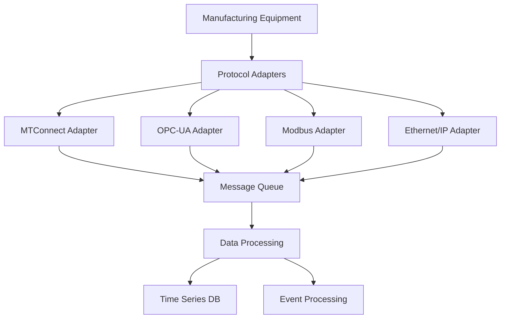
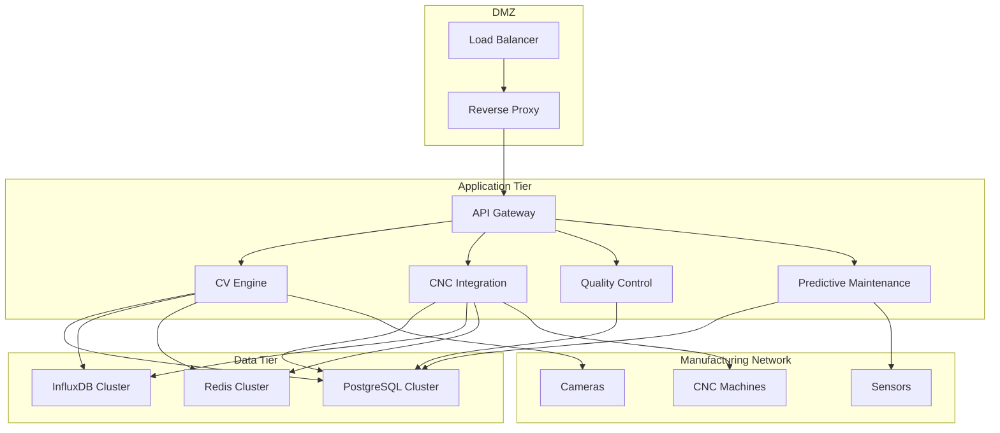
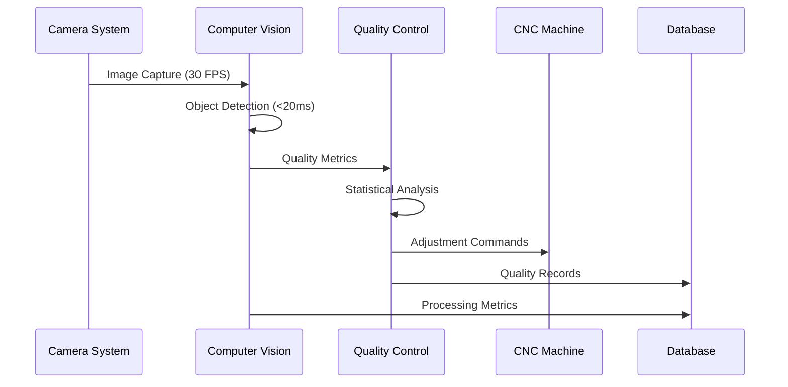
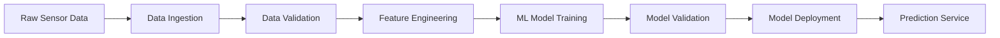
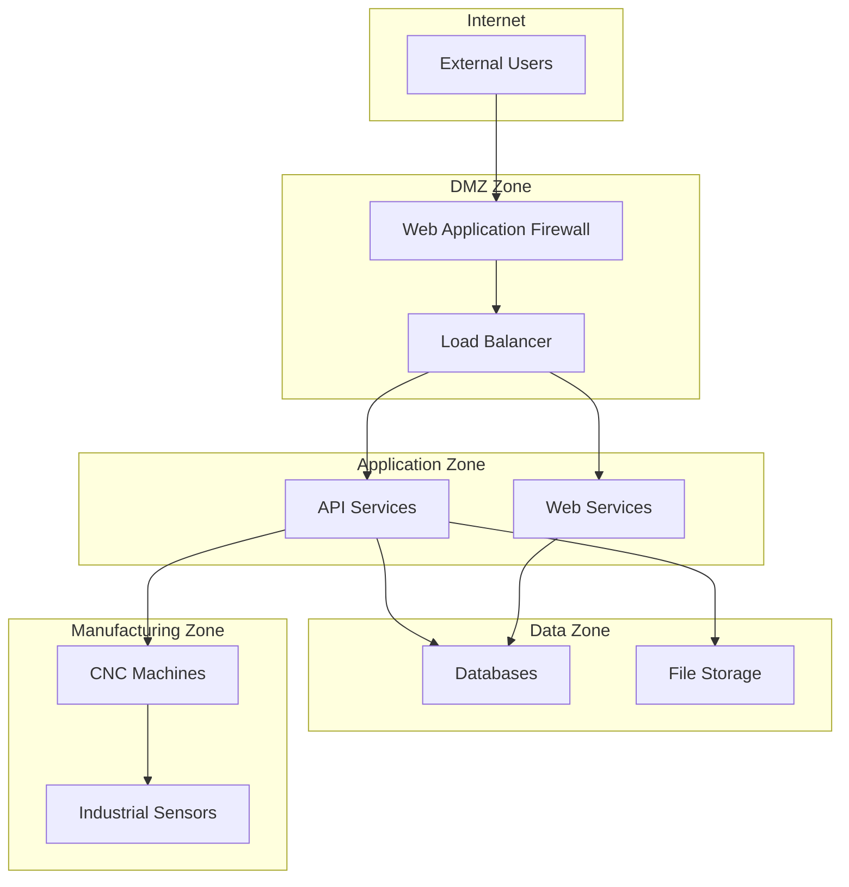

# System Architecture

## Overview

The Computer Vision CNC Manufacturing Platform is designed as a distributed, microservices-based system that provides enterprise-grade manufacturing optimization through advanced computer vision and Industry 4.0 technologies.

## Architecture Principles

### 1. Security by Design (IEC 62443)
- **Defense in Depth**: Multiple layers of security controls
- **Zero Trust Architecture**: Never trust, always verify
- **Least Privilege Access**: Minimal access rights for each component
- **Secure Communication**: End-to-end encryption for all data transmission

### 2. Manufacturing Reliability
- **High Availability**: 99.9% uptime requirement
- **Fault Tolerance**: Graceful degradation during component failures
- **Real-time Processing**: Sub-20ms latency for critical operations
- **Data Integrity**: Immutable audit trails for compliance

### 3. Scalability and Performance
- **Horizontal Scaling**: Auto-scaling based on manufacturing demand
- **Resource Optimization**: Efficient CPU and GPU utilization
- **Edge Computing**: Local processing for reduced latency
- **Load Balancing**: Distributed processing across multiple nodes

## System Components

### Core Services Layer

#### 1. API Gateway
- **Purpose**: Central entry point for all external communications
- **Responsibilities**:
  - Request routing and load balancing
  - Authentication and authorization
  - Rate limiting and throttling
  - API versioning and documentation
- **Technology**: FastAPI with custom middleware
- **Security**: JWT authentication, API key validation

#### 2. Computer Vision Engine
- **Purpose**: Real-time image processing and analysis
- **Responsibilities**:
  - Multi-camera image acquisition
  - Real-time quality inspection
  - Defect detection and classification
  - Statistical process control
- **Technology**: PyTorch/TensorFlow with OpenCV
- **Performance**: <20ms processing latency, 98%+ accuracy

#### 3. CNC Integration Service
- **Purpose**: Communication with CNC machines and manufacturing equipment
- **Responsibilities**:
  - MTConnect protocol implementation
  - OPC-UA secure communication
  - Real-time machine monitoring
  - Tool condition monitoring
- **Technology**: asyncua, pymodbus, custom protocol adapters
- **Protocols**: MTConnect (ANSI/MTC1.4-2018), OPC-UA (IEC 62541)

#### 4. Quality Control Manager
- **Purpose**: Automated quality assurance and validation
- **Responsibilities**:
  - Measurement validation
  - Statistical quality control
  - Non-conformance tracking
  - Calibration management
- **Technology**: Python with statistical libraries
- **Standards**: ISO 9001, IATF 16949 compliance

#### 5. Predictive Maintenance Engine
- **Purpose**: Proactive maintenance scheduling and optimization
- **Responsibilities**:
  - Machine learning-based failure prediction
  - Vibration and temperature analysis
  - Tool wear prediction
  - Maintenance scheduling optimization
- **Technology**: Scikit-learn, TensorFlow for ML models
- **Accuracy**: 95%+ prediction accuracy, 30% maintenance cost reduction

### Data Layer

#### 1. Primary Database (PostgreSQL)
- **Purpose**: Transactional data storage
- **Data Types**:
  - Manufacturing configurations
  - Quality control records
  - User management
  - Audit logs
- **Features**: ACID compliance, JSON support, full-text search

#### 2. Time Series Database (InfluxDB)
- **Purpose**: High-frequency manufacturing metrics
- **Data Types**:
  - Machine sensor data
  - Performance metrics
  - Temperature and vibration data
  - Production statistics
- **Features**: High write throughput, automatic data retention

#### 3. Cache Layer (Redis)
- **Purpose**: High-speed data access and session management
- **Data Types**:
  - Session tokens
  - Frequently accessed configurations
  - Real-time processing queues
  - Cache invalidation patterns
- **Features**: In-memory performance, persistence options

#### 4. Object Storage
- **Purpose**: Large file and media storage
- **Data Types**:
  - Computer vision models
  - Captured images and videos
  - Manufacturing documentation
  - Backup files
- **Technology**: MinIO (S3-compatible) or cloud storage

### Manufacturing Integration Layer

#### 1. Protocol Adapters

#### 2. Communication Patterns
- **Synchronous**: REST API for configuration and control
- **Asynchronous**: Message queues for high-volume data
- **Real-time**: WebSocket for live monitoring
- **Batch**: Scheduled data processing and reporting

### Security Layer

#### 1. Authentication and Authorization
- **Multi-factor Authentication**: TOTP, FIDO2 support
- **Role-based Access Control**: Manufacturing-specific roles
- **Certificate-based Authentication**: X.509 for machine communication
- **Session Management**: Secure token handling with Redis

#### 2. Network Security
- **Network Segmentation**: Isolated VLANs for different functions
- **Firewall Rules**: Strict ingress/egress controls
- **VPN Access**: Secure remote access for maintenance
- **Intrusion Detection**: Real-time threat monitoring

#### 3. Data Protection
- **Encryption at Rest**: AES-256 for stored data
- **Encryption in Transit**: TLS 1.3 for all communications
- **Key Management**: Hardware Security Module (HSM) integration
- **Data Loss Prevention**: Automated backup and recovery

## Deployment Architecture

### Production Environment

### Container Orchestration

#### Kubernetes Configuration
- **Namespaces**: Environment isolation (dev, staging, prod)
- **Resource Limits**: CPU and memory constraints
- **Health Checks**: Liveness and readiness probes
- **Auto-scaling**: HPA based on manufacturing load
- **Persistent Volumes**: Stateful data storage

#### Service Mesh (Istio)
- **Traffic Management**: Canary deployments, circuit breakers
- **Security**: mTLS between services
- **Observability**: Distributed tracing and metrics
- **Policy Enforcement**: Manufacturing-specific policies

## Data Flow Architecture

### 1. Real-time Processing Pipeline

### 2. Batch Processing Pipeline

## Performance Characteristics

### Latency Requirements
- **Computer Vision**: <20ms per frame
- **CNC Communication**: <100ms response time
- **Quality Decision**: <500ms from image to decision
- **Predictive Analysis**: <5 seconds for complex predictions

### Throughput Requirements
- **Image Processing**: 30 FPS per camera (up to 8 cameras)
- **Sensor Data**: 1000 samples/second per sensor
- **API Requests**: 10,000 requests/minute
- **Data Storage**: 10GB/day manufacturing data

### Availability Requirements
- **System Uptime**: 99.9% (8.76 hours downtime/year)
- **Recovery Time**: <15 minutes for critical failures
- **Backup Frequency**: Continuous replication
- **Disaster Recovery**: <4 hours RTO, <1 hour RPO

## Integration Patterns

### 1. Event-Driven Architecture
- **Event Bus**: Apache Kafka for reliable message delivery
- **Event Sourcing**: Immutable event logs for audit trails
- **CQRS**: Separate read/write models for optimization
- **Saga Pattern**: Distributed transaction management

### 2. API Design Patterns
- **RESTful APIs**: Resource-based operations
- **GraphQL**: Flexible data queries
- **WebSocket**: Real-time bidirectional communication
- **gRPC**: High-performance service communication

### 3. Data Integration Patterns
- **ETL Pipelines**: Extract, transform, load processes
- **CDC**: Change data capture for real-time sync
- **Data Lake**: Centralized storage for analytics
- **Data Mesh**: Distributed data ownership

## Security Architecture

### 1. Network Security Zones

### 2. Identity and Access Management
- **Single Sign-On**: SAML/OIDC integration
- **Multi-factor Authentication**: Time-based OTP, biometrics
- **Role-based Access**: Manufacturing-specific permissions
- **Privileged Access Management**: Elevated access controls

## Monitoring and Observability

### 1. Metrics Collection
- **Application Metrics**: Prometheus with custom exporters
- **Infrastructure Metrics**: Node exporter, container metrics
- **Business Metrics**: Manufacturing KPIs and quality metrics
- **Security Metrics**: Security events and compliance status

### 2. Logging Strategy
- **Centralized Logging**: ELK stack (Elasticsearch, Logstash, Kibana)
- **Structured Logging**: JSON format with correlation IDs
- **Log Retention**: Compliance-based retention policies
- **Log Security**: Encryption and integrity protection

### 3. Alerting Framework
- **Real-time Alerts**: Critical manufacturing events
- **Predictive Alerts**: Maintenance predictions
- **Escalation Policies**: Manufacturing shift-based escalation
- **Alert Correlation**: Intelligent alert grouping

## Compliance and Audit

### 1. Manufacturing Standards
- **ISO 9001**: Quality management system compliance
- **IATF 16949**: Automotive quality requirements
- **IEC 62443**: Industrial cybersecurity standards
- **NIST Cybersecurity Framework**: Security controls

### 2. Audit Trail Requirements
- **Immutable Logs**: Blockchain-based audit trails
- **Data Lineage**: Complete data transformation tracking
- **Access Logging**: All user and system access events
- **Change Management**: Configuration change tracking

## Future Architecture Considerations

### 1. Edge Computing
- **Edge Nodes**: Local processing for reduced latency
- **Distributed Intelligence**: AI at the edge
- **Synchronization**: Edge-to-cloud data sync
- **Offline Capability**: Autonomous operation during disconnection

### 2. AI/ML Integration
- **AutoML**: Automated model training and optimization
- **Federated Learning**: Distributed model training
- **Explainable AI**: Transparent decision making
- **Continuous Learning**: Real-time model adaptation

### 3. Industry 4.0 Evolution
- **Digital Twin**: Virtual manufacturing models
- **Augmented Reality**: Enhanced operator interfaces
- **Blockchain**: Supply chain traceability
- **5G Integration**: Ultra-low latency communication

---

*This architecture document is continuously updated to reflect the latest platform capabilities and manufacturing industry requirements. For specific implementation details, refer to the component-specific documentation.*
