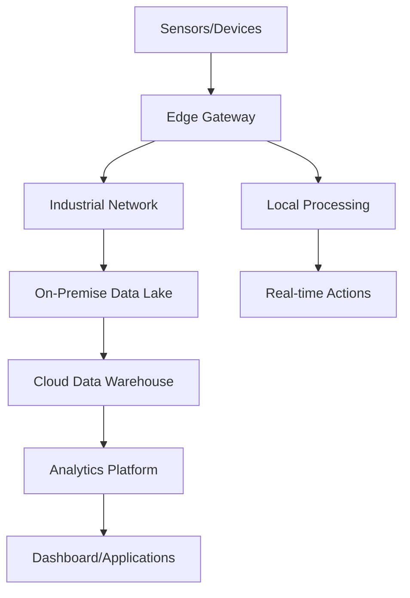

# Industry 4.0 Implementation Guide

## Executive Summary

This comprehensive guide provides organizations with a structured approach to implementing Industry 4.0 technologies and practices. It emphasizes security-first design, scalable architecture, and sustainable transformation strategies that align with modern industrial requirements.

---

## Table of Contents

1. [Introduction to Industry 4.0](#introduction)
2. [Pre-Implementation Assessment](#assessment)
3. [Strategic Planning Framework](#planning)
4. [Technology Stack Selection](#technology-stack)
5. [Security-First Implementation](#security)
6. [Architecture and Infrastructure](#architecture)
7. [Implementation Phases](#implementation)
8. [Change Management and Training](#change-management)
9. [Monitoring and Optimization](#monitoring)
10. [Compliance and Standards](#compliance)
11. [Resources and Further Learning](#resources)

---

## 1. Introduction to Industry 4.0 {#introduction}

### Definition and Core Principles

Industry 4.0 represents the fourth industrial revolution, characterized by the integration of digital technologies into manufacturing and industrial processes. The transformation focuses on creating **smart factories** that leverage interconnected systems for autonomous decision-making.

### Key Technologies

| Technology | Application | Business Impact |
|------------|-------------|-----------------|
| **IoT Sensors** | Real-time monitoring | 25-30% reduction in downtime |
| **AI/ML Analytics** | Predictive maintenance | 10-20% cost savings |
| **Digital Twins** | Process simulation | 15-25% efficiency gains |
| **Edge Computing** | Low-latency processing | Sub-millisecond response times |
| **Blockchain** | Supply chain transparency | 30% reduction in fraud |

### Business Drivers

- **Operational Efficiency**: Reduce waste and optimize resource utilization
- **Predictive Capabilities**: Minimize unplanned downtime through predictive analytics
- **Mass Customization**: Enable flexible production for personalized products
- **Supply Chain Visibility**: End-to-end traceability and transparency
- **Regulatory Compliance**: Automated compliance monitoring and reporting

---

## 2. Pre-Implementation Assessment {#assessment}

### Current State Analysis

#### Infrastructure Audit Checklist
```markdown
- [ ] Network capacity and coverage assessment
- [ ] Legacy system inventory and compatibility analysis  
- [ ] Data collection capabilities evaluation
- [ ] Cybersecurity posture assessment
- [ ] Skill gap analysis for workforce
- [ ] Regulatory compliance requirements review
```

### Maturity Assessment Framework

**Level 1 - Basic Digitization**
- Manual processes with basic digital tools
- Limited data collection and analysis
- Reactive maintenance approaches

**Level 2 - Digital Connectivity** 
- Connected systems with basic automation
- Real-time data monitoring capabilities
- Some predictive analytics implementation

**Level 3 - Digital Visibility**
- Integrated data across systems
- Advanced analytics and visualization
- Proactive decision-making processes

**Level 4 - Digital Transformation**
- Autonomous systems and processes
- AI-driven optimization
- Full ecosystem integration

### Risk Assessment Matrix

| Risk Category | Impact | Probability | Mitigation Strategy |
|---------------|--------|-------------|-------------------|
| **Cybersecurity** | High | Medium | Zero-trust architecture, segmentation |
| **Integration Complexity** | High | High | Phased implementation, API-first design |
| **Skills Gap** | Medium | High | Training programs, strategic hiring |
| **ROI Timeline** | Medium | Medium | Pilot projects, quick wins identification |

---

## 3. Strategic Planning Framework {#planning}

### Vision and Objectives Definition

#### SMART Goals Template
```
Specific: Define exact outcomes (e.g., "Reduce equipment downtime by 25%")
Measurable: Establish KPIs and metrics
Achievable: Assess resource and capability requirements  
Relevant: Align with business strategy and market demands
Time-bound: Set clear milestones and deadlines
```

### Stakeholder Alignment Strategy

**Executive Leadership**
- Focus: ROI, competitive advantage, strategic positioning
- Communication: Business case presentations, financial projections

**Operations Teams**  
- Focus: Process improvement, efficiency gains, safety enhancement
- Communication: Operational benefits, workflow optimization

**IT Department**
- Focus: Technical feasibility, security, integration complexity
- Communication: Architecture diagrams, technical specifications

**Workforce**
- Focus: Job security, skill development, change impact
- Communication: Training plans, career development paths

---

## 4. Technology Stack Selection {#technology-stack}

### Core Infrastructure Components

#### Edge Computing Layer
```yaml
# Edge Device Specifications
Hardware Requirements:
  - CPU: ARM Cortex-A78 or Intel Atom x6000 series
  - RAM: Minimum 8GB, Recommended 16GB
  - Storage: 256GB NVMe SSD with industrial temperature rating
  - Connectivity: 5G, Wi-Fi 6, Ethernet, Industrial protocols

Software Stack:
  - Container Runtime: Docker or Podman
  - Orchestration: K3s (lightweight Kubernetes)
  - Security: TPM 2.0, secure boot, hardware encryption
```

#### Cloud Platform Selection Criteria

**AWS IoT Core + Industrial Services**
- **Pros**: Comprehensive IoT services, strong ML capabilities
- **Cons**: Vendor lock-in concerns, complexity
- **Best For**: Large-scale deployments with diverse use cases

**Microsoft Azure IoT + Digital Twins**
- **Pros**: Strong enterprise integration, hybrid cloud support  
- **Cons**: Learning curve for non-Microsoft environments
- **Best For**: Organizations with existing Microsoft ecosystem

**Google Cloud IoT + AI Platform**
- **Pros**: Superior AI/ML capabilities, data analytics
- **Cons**: Smaller IoT ecosystem, enterprise features
- **Best For**: Data-heavy applications requiring advanced analytics

### Data Architecture Design

#### Data Flow Architecture


#### Data Governance Framework
- **Data Classification**: Sensitive, confidential, public
- **Access Controls**: Role-based permissions, data masking
- **Retention Policies**: Automated lifecycle management
- **Quality Standards**: Validation rules, anomaly detection

---

## 5. Security-First Implementation {#security}

### Zero-Trust Architecture Principles

#### Network Segmentation Strategy
```
Production Network (OT)
├── Critical Control Systems (Air-gapped)
├── Manufacturing Execution Systems (Firewalled)
└── Monitoring and Analytics (DMZ)

Corporate Network (IT)  
├── Enterprise Applications
├── User Workstations
└── Guest Network (Isolated)
```

### Critical Security Controls

#### 1. Device Authentication and Authorization
```json
{
  "deviceSecurity": {
    "authentication": {
      "method": "mutual_tls_certificates",
      "certificateRotation": "90_days",
      "hardwareSecurityModule": "required"
    },
    "authorization": {
      "model": "attribute_based_access_control",
      "principleOfLeastPrivilege": true,
      "contextualAccess": "location_time_role"
    }
  }
}
```

#### 2. Data Protection Measures
- **Encryption at Rest**: AES-256 with hardware security modules
- **Encryption in Transit**: TLS 1.3 with perfect forward secrecy
- **Key Management**: FIPS 140-2 Level 3 compliance
- **Data Loss Prevention**: Classification-based policies

#### 3. Incident Response Framework
```markdown
Detection → Analysis → Containment → Eradication → Recovery → Lessons Learned

- Automated threat detection using SIEM/SOAR
- 15-minute response time for critical incidents  
- Business continuity plans for operational disruption
- Regular tabletop exercises and security drills
```

### Security Monitoring and Compliance

#### Continuous Monitoring Tools
- **Network Traffic Analysis**: Detect anomalous communication patterns
- **Behavioral Analytics**: Identify unusual user and device behavior
- **Vulnerability Management**: Automated scanning and patch management
- **Compliance Monitoring**: Real-time adherence to regulatory standards

---

## 6. Architecture and Infrastructure {#architecture}

### Scalable System Design

#### Microservices Architecture Pattern
```yaml
# Example Service Definitions
services:
  device-management:
    function: "Device registration, configuration, monitoring"
    technology: "Node.js, MongoDB"
    scaling: "Horizontal, auto-scaling enabled"
    
  data-processing:
    function: "Real-time stream processing and analytics"
    technology: "Apache Kafka, Apache Flink"
    scaling: "Elastic scaling based on throughput"
    
  visualization:
    function: "Dashboards and reporting"
    technology: "React.js, D3.js, WebSocket"
    scaling: "CDN-distributed, caching layer"
```

#### Integration Patterns

**API-First Design Principles**
- RESTful APIs with OpenAPI 3.0 specifications
- GraphQL for complex data queries
- Event-driven architecture using message brokers
- Circuit breaker pattern for resilience

**Legacy System Integration**
```python
# Example: Legacy SCADA Integration Adapter
class SCADAIntegrationAdapter:
    """
    Secure adapter for legacy SCADA system integration
    Implements protocol translation and security controls
    """
    
    def __init__(self, scada_endpoint, security_config):
        self.endpoint = scada_endpoint
        self.security = security_config
        self.connection_pool = self._initialize_secure_connections()
    
    def read_realtime_data(self):
        """
        Securely fetch real-time data from SCADA systems
        Implements retry logic and error handling
        """
        try:
            # Establish secure connection
            connection = self._get_secure_connection()
            
            # Fetch data with validation
            raw_data = connection.fetch_data()
            validated_data = self._validate_data_integrity(raw_data)
            
            # Transform to standard format
            return self._transform_to_standard_format(validated_data)
            
        except Exception as e:
            self._log_security_event(e)
            raise SecureIntegrationException(f"SCADA integration failed: {e}")
```

### Performance and Reliability

#### Service Level Objectives (SLOs)
- **Availability**: 99.9% uptime (8.76 hours downtime/year)
- **Latency**: <100ms for real-time operations, <1s for analytics
- **Throughput**: Support for 1M+ IoT messages per second
- **Data Integrity**: 99.99% accuracy with validation checksums

---

## 7. Implementation Phases {#implementation}

### Phase 1: Foundation (Months 1-3)

#### Objectives
- Establish core infrastructure and security frameworks
- Deploy initial monitoring and data collection systems
- Train core technical teams

#### Key Deliverables
```markdown
- [ ] Network infrastructure upgrade and segmentation
- [ ] Core security controls implementation
- [ ] Edge computing infrastructure deployment  
- [ ] Initial IoT sensor installation (pilot area)
- [ ] Data pipeline establishment
- [ ] Basic monitoring dashboard deployment
```

#### Success Metrics
- 100% uptime for critical systems during deployment
- Zero security incidents during infrastructure setup
- 90% technical team training completion rate

### Phase 2: Integration (Months 4-8)

#### Objectives
- Connect legacy systems to new digital infrastructure
- Implement advanced analytics and ML capabilities
- Expand IoT deployment to additional production areas

#### Key Deliverables
```markdown
- [ ] Legacy system integration completion
- [ ] Predictive analytics model deployment
- [ ] Digital twin development for critical equipment
- [ ] Mobile application for field workers
- [ ] Advanced reporting and visualization tools
- [ ] Automated workflow implementations
```

### Phase 3: Optimization (Months 9-12)

#### Objectives
- Achieve autonomous operations for routine processes
- Implement advanced AI-driven decision making
- Scale across entire organization

#### Key Deliverables
```markdown
- [ ] Autonomous quality control systems
- [ ] AI-powered production optimization
- [ ] Full supply chain visibility implementation
- [ ] Advanced cybersecurity threat detection
- [ ] Organization-wide digital literacy achievement
```

---

## 8. Change Management and Training {#change-management}

### Organizational Change Strategy

#### Communication Framework
```
Leadership Alignment (Monthly)
├── Strategic updates and decision making
├── Budget and resource allocation reviews
└── Stakeholder feedback integration

Management Engagement (Bi-weekly)  
├── Implementation progress tracking
├── Issue escalation and resolution
└── Team coordination and support

Workforce Communication (Weekly)
├── Training updates and schedules
├── Process change notifications  
└── Feedback collection and response
```

### Comprehensive Training Program

#### Technical Skills Development
- **IoT and Sensor Technologies**: 40-hour certification program
- **Data Analytics and Visualization**: Hands-on workshops with real data
- **Cybersecurity Awareness**: Mandatory quarterly training
- **Digital Tool Proficiency**: Role-specific application training

#### Training Delivery Methods
- **Blended Learning Approach**: Online modules + hands-on labs
- **Peer-to-Peer Knowledge Transfer**: Expert-led mentoring programs
- **External Partnerships**: Vendor-provided specialized training
- **Continuous Learning Platform**: Micro-learning and just-in-time resources

---

## 9. Monitoring and Optimization {#monitoring}

### Key Performance Indicators (KPIs)

#### Operational Excellence Metrics
```yaml
Production Efficiency:
  - Overall Equipment Effectiveness (OEE): Target >85%
  - First Pass Yield: Target >95%
  - Cycle Time Reduction: Target 20% improvement

Quality Metrics:
  - Defect Rate: Target <0.1%
  - Customer Satisfaction: Target >4.5/5.0
  - Recall Incidents: Target zero

Cost Management:
  - Operating Cost Reduction: Target 15%
  - Energy Consumption: Target 20% reduction
  - Maintenance Cost Optimization: Target 25% reduction
```

#### Digital Transformation Metrics
- **Data Quality Score**: Completeness, accuracy, timeliness
- **System Integration Health**: API response times, error rates
- **User Adoption Rate**: Active users, feature utilization
- **Innovation Index**: Number of AI-driven improvements implemented

### Continuous Improvement Framework

#### Data-Driven Decision Making
```python
# Example: Automated Performance Analysis
class PerformanceOptimizer:
    """
    Continuously analyzes system performance and suggests optimizations
    Uses machine learning to identify improvement opportunities
    """
    
    def analyze_production_data(self, time_period):
        """
        Analyzes production data to identify optimization opportunities
        """
        # Collect multi-dimensional performance data
        performance_data = self._collect_performance_metrics(time_period)
        
        # Apply ML algorithms for pattern recognition
        optimization_opportunities = self._identify_optimization_patterns(
            performance_data
        )
        
        # Generate actionable recommendations
        recommendations = self._generate_recommendations(
            optimization_opportunities
        )
        
        return {
            'current_performance': performance_data.summary(),
            'opportunities': optimization_opportunities,
            'recommendations': recommendations,
            'projected_impact': self._calculate_projected_impact(recommendations)
        }
```

---

## 10. Compliance and Standards {#compliance}

### Regulatory Compliance Framework

#### Industry Standards Adherence
- **ISO 27001**: Information security management systems
- **IEC 62443**: Industrial cybersecurity standards
- **NIST Cybersecurity Framework**: Risk management approach
- **ISO 9001**: Quality management systems
- **ISO 14001**: Environmental management systems

#### Data Protection and Privacy
```markdown
GDPR Compliance (EU):
- [ ] Data protection impact assessments
- [ ] Consent management systems
- [ ] Right to erasure implementation
- [ ] Data portability capabilities

CCPA Compliance (California):
- [ ] Consumer rights portal
- [ ] Data inventory and mapping
- [ ] Opt-out mechanisms
- [ ] Third-party data sharing controls
```

### Audit and Documentation Requirements

#### Compliance Documentation
- **Security Policies and Procedures**: Comprehensive security governance
- **Data Processing Records**: GDPR Article 30 compliance
- **Risk Assessment Reports**: Regular security and operational risk reviews
- **Incident Response Logs**: Detailed incident tracking and resolution
- **Training Records**: Employee certification and competency tracking

---

## 11. Resources and Further Learning {#resources}

### Essential Reading and Certifications

#### Books and Publications
- "Industry 4.0: The Industrial Internet of Things" by Alasdair Gilchrist
- "The Technology Fallacy" by Kane, Phillips, Copulsky, and Andrus  
- "Digital to the Core" by Gartner Inc.
- "Industrial Internet of Things" by Cisco Press

#### Professional Certifications
- **AWS Certified IoT Core**: Cloud-based IoT solutions
- **Microsoft Azure IoT Developer**: Azure IoT platform expertise
- **Certified Information Security Manager (CISM)**: Security leadership
- **Project Management Professional (PMP)**: Implementation project management

### Technology Vendor Resources

#### Leading Platform Providers
```markdown
Industrial IoT Platforms:
- Siemens MindSphere: Digital manufacturing suite
- GE Predix: Industrial analytics platform  
- PTC ThingWorx: IoT application development
- Rockwell FactoryTalk: Connected services platform

Cloud Service Providers:
- AWS IoT Industrial Services
- Microsoft Azure Industrial IoT
- Google Cloud IoT and AI Platform
- IBM Watson IoT Platform
```

### Community and Professional Networks

#### Industry Organizations
- **Industrial Internet Consortium (IIC)**: Standards and best practices
- **Manufacturing Leadership Council**: Executive-level insights
- **Society of Manufacturing Engineers (SME)**: Technical resources
- **International Society of Automation (ISA)**: Automation standards

#### Online Communities and Forums
- LinkedIn Industry 4.0 Professional Groups
- Reddit Manufacturing and IoT Communities  
- Stack Overflow Industrial IoT Tags
- GitHub Open Source Industrial Projects

---

## Conclusion

Industry 4.0 implementation requires a strategic, security-first approach that balances technological innovation with operational stability. Success depends on thorough planning, stakeholder alignment, and continuous optimization based on data-driven insights.

### Key Success Factors
1. **Executive Commitment**: Sustained leadership support and resource allocation
2. **Security by Design**: Integrated cybersecurity from project inception
3. **Phased Implementation**: Manageable rollout with measurable milestones
4. **Workforce Development**: Comprehensive training and change management
5. **Continuous Improvement**: Data-driven optimization and adaptation

### Next Steps
1. Conduct comprehensive readiness assessment using provided frameworks
2. Develop detailed implementation roadmap with defined milestones  
3. Establish security governance and risk management processes
4. Begin pilot project in controlled environment
5. Scale successful implementations across organization

For additional guidance and support, consider engaging with specialized Industry 4.0 consultants and technology partners who can provide customized solutions for your specific industry and organizational requirements.

---

*Document Version: 1.0 | Last Updated: August 2025 | Classification: Internal Use*
