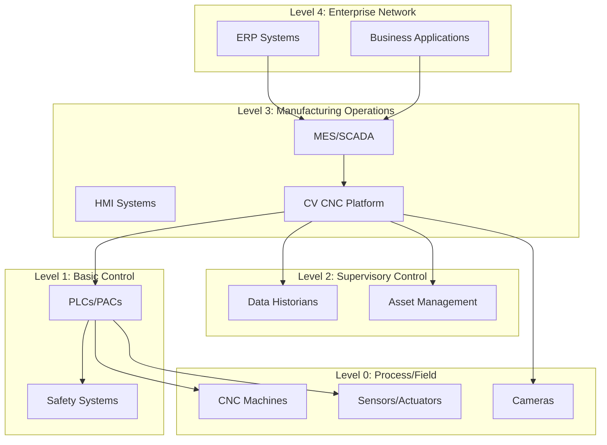

# IEC 62443 Security Framework Implementation

## Overview

The Computer Vision CNC Manufacturing Platform implements a comprehensive security framework based on IEC 62443 industrial cybersecurity standards, designed specifically for manufacturing environments with critical operational requirements.

## IEC 62443 Framework Structure

### Security Levels (SL)

The platform implements Security Level 3 (SL-3) to protect against:
- **Intentional violation using sophisticated means**
- **Extended resources, IACS specific skills**
- **Protection against nation-state attacks**

### Security Zones and Conduits



## Security Requirements Implementation

### SR 1: Identification and Authentication Control

#### 1.1 Human User Identification and Authentication

```python
# Authentication service implementation
class AuthenticationService:
    def __init__(self):
        self.mfa_required = True
        self.password_policy = PasswordPolicy(
            min_length=12,
            require_special_chars=True,
            require_numbers=True,
            require_uppercase=True,
            max_age_days=90
        )
    
    async def authenticate_user(
        self, 
        username: str, 
        password: str, 
        mfa_token: Optional[str] = None
    ) -> AuthenticationResult:
        # Multi-factor authentication required
        if not await self.verify_credentials(username, password):
            raise AuthenticationError("Invalid credentials")
        
        if self.mfa_required and not mfa_token:
            raise MFARequiredError("Multi-factor authentication required")
        
        if mfa_token and not await self.verify_mfa(username, mfa_token):
            raise AuthenticationError("Invalid MFA token")
        
        return await self.create_session(username)
```

#### 1.2 Software Process and Device Identification

```python
# Device authentication using X.509 certificates
class DeviceAuthentication:
    def __init__(self, ca_certificate_path: str):
        self.ca_cert = load_certificate(ca_certificate_path)
        self.device_registry = DeviceRegistry()
    
    async def authenticate_device(self, device_cert: bytes) -> DeviceIdentity:
        cert = load_certificate(device_cert)
        
        # Verify certificate chain
        if not self.verify_certificate_chain(cert, self.ca_cert):
            raise DeviceAuthenticationError("Invalid certificate chain")
        
        # Check device registration
        device_id = cert.subject.get_attributes_for_oid(NameOID.COMMON_NAME)[0].value
        if not await self.device_registry.is_registered(device_id):
            raise DeviceAuthenticationError("Device not registered")
        
        return DeviceIdentity(
            device_id=device_id,
            certificate=cert,
            authenticated_at=datetime.utcnow()
        )
```

### SR 2: Use Control

#### 2.1 Authorization Enforcement

```python
# Role-based access control implementation
class RoleBasedAccessControl:
    def __init__(self):
        self.roles = {
            'operator': [
                'view_production_status',
                'start_production',
                'stop_production'
            ],
            'quality_inspector': [
                'view_quality_metrics',
                'approve_quality_results',
                'reject_parts'
            ],
            'maintenance_technician': [
                'view_maintenance_status',
                'schedule_maintenance',
                'update_maintenance_records'
            ],
            'security_administrator': [
                'manage_users',
                'configure_security_settings',
                'view_audit_logs'
            ]
        }
    
    def check_permission(self, user: User, resource: str, action: str) -> bool:
        required_permission = f"{action}_{resource}"
        user_permissions = []
        
        for role in user.roles:
            user_permissions.extend(self.roles.get(role, []))
        
        return required_permission in user_permissions
```

#### 2.2 Wireless Use Control

```python
# Wireless security configuration
class WirelessSecurityConfig:
    def __init__(self):
        self.allowed_protocols = ['WPA3-Enterprise', 'WPA2-Enterprise']
        self.certificate_auth_required = True
        self.monitoring_enabled = True
    
    def validate_wireless_connection(self, connection: WirelessConnection) -> bool:
        if connection.protocol not in self.allowed_protocols:
            return False
        
        if self.certificate_auth_required and not connection.has_certificate:
            return False
        
        return True
```

### SR 3: System Integrity

#### 3.1 Communication Integrity

```python
# Secure communication implementation
class SecureCommunication:
    def __init__(self):
        self.tls_version = "1.3"
        self.cipher_suites = [
            "TLS_AES_256_GCM_SHA384",
            "TLS_CHACHA20_POLY1305_SHA256"
        ]
        self.certificate_validation = True
    
    async def establish_secure_channel(
        self, 
        endpoint: str, 
        client_cert: Optional[Certificate] = None
    ) -> SecureChannel:
        context = ssl.create_default_context()
        context.minimum_version = ssl.TLSVersion.TLSv1_3
        context.set_ciphers(':'.join(self.cipher_suites))
        
        if client_cert:
            context.load_cert_chain(client_cert.cert_path, client_cert.key_path)
        
        return await SecureChannel.connect(endpoint, ssl_context=context)
```

#### 3.2 Software and Information Integrity

```python
# Code signing and verification
class IntegrityVerification:
    def __init__(self, public_key_path: str):
        self.public_key = load_public_key(public_key_path)
        self.hash_algorithm = "SHA-256"
    
    def verify_software_integrity(self, software_path: str, signature: bytes) -> bool:
        with open(software_path, 'rb') as f:
            software_hash = hashlib.sha256(f.read()).digest()
        
        try:
            self.public_key.verify(
                signature,
                software_hash,
                padding.PSS(
                    mgf=padding.MGF1(hashes.SHA256()),
                    salt_length=padding.PSS.MAX_LENGTH
                ),
                hashes.SHA256()
            )
            return True
        except InvalidSignature:
            return False
```

### SR 4: Data Confidentiality

#### 4.1 Information Confidentiality

```python
# Data encryption service
class DataEncryptionService:
    def __init__(self, key_management_service: KeyManagementService):
        self.kms = key_management_service
        self.algorithm = "AES-256-GCM"
    
    async def encrypt_sensitive_data(self, data: bytes, context: dict) -> EncryptedData:
        # Get data encryption key from KMS
        dek = await self.kms.generate_data_key(context)
        
        # Encrypt data with AES-256-GCM
        cipher = Cipher(
            algorithms.AES(dek.key),
            modes.GCM(dek.iv),
            backend=default_backend()
        )
        encryptor = cipher.encryptor()
        ciphertext = encryptor.update(data) + encryptor.finalize()
        
        return EncryptedData(
            ciphertext=ciphertext,
            encrypted_key=dek.encrypted_key,
            iv=dek.iv,
            tag=encryptor.tag,
            algorithm=self.algorithm
        )
```

#### 4.2 Cryptographic Key Management

```python
# Hardware Security Module integration
class HSMKeyManagement:
    def __init__(self, hsm_config: HSMConfig):
        self.hsm_session = HSMSession(hsm_config)
        self.key_rotation_interval = timedelta(days=90)
    
    async def generate_master_key(self, key_spec: KeySpecification) -> MasterKey:
        key_handle = await self.hsm_session.generate_key(
            algorithm=key_spec.algorithm,
            key_size=key_spec.size,
            usage=key_spec.usage,
            extractable=False  # Key never leaves HSM
        )
        
        return MasterKey(
            handle=key_handle,
            created_at=datetime.utcnow(),
            next_rotation=datetime.utcnow() + self.key_rotation_interval
        )
```

### SR 5: Restricted Data Flow

#### 5.1 Network Segmentation

```python
# Network segmentation configuration
class NetworkSegmentation:
    def __init__(self):
        self.zones = {
            'enterprise': {
                'vlan_id': 100,
                'subnet': '10.1.0.0/24',
                'access_rules': ['allow_internet', 'allow_corporate']
            },
            'manufacturing': {
                'vlan_id': 200,
                'subnet': '10.2.0.0/24',
                'access_rules': ['deny_internet', 'allow_manufacturing']
            },
            'control': {
                'vlan_id': 300,
                'subnet': '10.3.0.0/24',
                'access_rules': ['deny_internet', 'allow_control_only']
            }
        }
    
    def get_firewall_rules(self, source_zone: str, dest_zone: str) -> List[FirewallRule]:
        if source_zone == 'manufacturing' and dest_zone == 'control':
            return [
                FirewallRule(
                    protocol='tcp',
                    port=502,  # Modbus
                    action='allow'
                ),
                FirewallRule(
                    protocol='tcp',
                    port=4840,  # OPC-UA
                    action='allow'
                )
            ]
        return [FirewallRule(action='deny')]
```

#### 5.2 Data Loss Prevention

```python
# Data loss prevention implementation
class DataLossPrevention:
    def __init__(self):
        self.sensitive_patterns = [
            r'\b\d{4}[-\s]?\d{4}[-\s]?\d{4}[-\s]?\d{4}\b',  # Credit card
            r'\b[A-Z]{2}\d{8}\b',  # Manufacturing part numbers
            r'\b\d{1,3}\.\d{1,3}\.\d{1,3}\.\d{1,3}\b'  # IP addresses
        ]
        self.encryption_required = True
    
    def scan_data_transmission(self, data: str) -> DLPScanResult:
        violations = []
        
        for pattern in self.sensitive_patterns:
            matches = re.findall(pattern, data)
            if matches:
                violations.append(DLPViolation(
                    pattern=pattern,
                    matches=matches,
                    severity='high'
                ))
        
        return DLPScanResult(
            violations=violations,
            allow_transmission=len(violations) == 0
        )
```

### SR 6: Timely Response to Events

#### 6.1 Audit Log Accessibility

```python
# Comprehensive audit logging
class AuditLogger:
    def __init__(self, log_storage: LogStorage):
        self.storage = log_storage
        self.integrity_protection = True
        self.encryption_enabled = True
    
    async def log_security_event(self, event: SecurityEvent) -> None:
        audit_entry = AuditLogEntry(
            timestamp=datetime.utcnow(),
            event_type=event.type,
            user_id=event.user_id,
            source_ip=event.source_ip,
            resource=event.resource,
            action=event.action,
            result=event.result,
            details=event.details
        )
        
        # Sign the log entry for integrity
        if self.integrity_protection:
            audit_entry.signature = self.sign_log_entry(audit_entry)
        
        # Encrypt sensitive log data
        if self.encryption_enabled:
            audit_entry = await self.encrypt_log_entry(audit_entry)
        
        await self.storage.store_log_entry(audit_entry)
```

#### 6.2 Incident Response

```python
# Automated incident response system
class IncidentResponseSystem:
    def __init__(self):
        self.response_playbooks = {
            'unauthorized_access': self.handle_unauthorized_access,
            'malware_detected': self.handle_malware_detection,
            'data_exfiltration': self.handle_data_exfiltration,
            'system_compromise': self.handle_system_compromise
        }
    
    async def handle_security_incident(self, incident: SecurityIncident) -> None:
        # Immediate response
        await self.isolate_affected_systems(incident.affected_systems)
        
        # Execute response playbook
        handler = self.response_playbooks.get(incident.type)
        if handler:
            await handler(incident)
        
        # Notify security team
        await self.notify_security_team(incident)
        
        # Create incident report
        await self.create_incident_report(incident)
```

## Security Monitoring and Detection

### 1. Intrusion Detection System

```python
# Network-based intrusion detection
class NetworkIntrusionDetection:
    def __init__(self):
        self.signatures = load_attack_signatures()
        self.anomaly_detector = AnomalyDetector()
        self.alert_threshold = 0.8
    
    async def analyze_network_traffic(self, traffic: NetworkTraffic) -> DetectionResult:
        # Signature-based detection
        signature_matches = self.check_signatures(traffic)
        
        # Anomaly-based detection
        anomaly_score = await self.anomaly_detector.analyze(traffic)
        
        if signature_matches or anomaly_score > self.alert_threshold:
            return DetectionResult(
                threat_detected=True,
                confidence=max(len(signature_matches) / 10, anomaly_score),
                recommendations=self.get_mitigation_recommendations(traffic)
            )
        
        return DetectionResult(threat_detected=False)
```

### 2. Security Information and Event Management (SIEM)

```python
# SIEM integration
class SIEMIntegration:
    def __init__(self, siem_endpoint: str):
        self.endpoint = siem_endpoint
        self.event_formatter = SIEMEventFormatter()
    
    async def send_security_event(self, event: SecurityEvent) -> None:
        formatted_event = self.event_formatter.format(event)
        
        async with aiohttp.ClientSession() as session:
            await session.post(
                f"{self.endpoint}/events",
                json=formatted_event,
                headers={'Content-Type': 'application/json'}
            )
```

## Compliance Validation

### 1. Security Assessment Framework

```python
# Continuous security assessment
class SecurityAssessment:
    def __init__(self):
        self.iec62443_requirements = load_iec62443_requirements()
        self.assessment_schedule = CronSchedule("0 2 * * 0")  # Weekly
    
    async def perform_security_assessment(self) -> AssessmentReport:
        results = []
        
        for requirement in self.iec62443_requirements:
            test_result = await self.test_requirement(requirement)
            results.append(test_result)
        
        compliance_score = sum(r.score for r in results) / len(results)
        
        return AssessmentReport(
            assessment_date=datetime.utcnow(),
            compliance_score=compliance_score,
            requirements_tested=len(results),
            requirements_passed=sum(1 for r in results if r.passed),
            detailed_results=results
        )
```

### 2. Vulnerability Management

```python
# Automated vulnerability scanning
class VulnerabilityScanner:
    def __init__(self):
        self.scan_schedule = CronSchedule("0 1 * * 1")  # Weekly Monday 1 AM
        self.critical_threshold = 9.0  # CVSS score
    
    async def scan_system_vulnerabilities(self) -> VulnerabilityScanReport:
        # Scan network infrastructure
        network_vulns = await self.scan_network_infrastructure()
        
        # Scan application components
        app_vulns = await self.scan_application_components()
        
        # Scan industrial protocols
        protocol_vulns = await self.scan_industrial_protocols()
        
        all_vulnerabilities = network_vulns + app_vulns + protocol_vulns
        critical_vulns = [v for v in all_vulnerabilities if v.cvss_score >= self.critical_threshold]
        
        return VulnerabilityScanReport(
            scan_date=datetime.utcnow(),
            total_vulnerabilities=len(all_vulnerabilities),
            critical_vulnerabilities=len(critical_vulns),
            vulnerabilities=all_vulnerabilities
        )
```

## Security Configuration Management

### 1. Security Hardening

```python
# System hardening configuration
class SecurityHardening:
    def __init__(self):
        self.hardening_rules = load_hardening_rules()
    
    async def apply_security_hardening(self, system: System) -> HardeningResult:
        applied_rules = []
        failed_rules = []
        
        for rule in self.hardening_rules:
            try:
                await self.apply_hardening_rule(system, rule)
                applied_rules.append(rule)
            except HardeningError as e:
                failed_rules.append((rule, str(e)))
        
        return HardeningResult(
            applied_rules=applied_rules,
            failed_rules=failed_rules,
            hardening_score=len(applied_rules) / len(self.hardening_rules)
        )
```

### 2. Configuration Compliance

```python
# Configuration compliance checking
class ConfigurationCompliance:
    def __init__(self):
        self.compliance_baselines = load_compliance_baselines()
    
    async def check_configuration_compliance(self, config: SystemConfiguration) -> ComplianceReport:
        violations = []
        
        for baseline in self.compliance_baselines:
            if not baseline.check_compliance(config):
                violations.append(ComplianceViolation(
                    baseline=baseline.name,
                    description=baseline.description,
                    severity=baseline.severity,
                    remediation=baseline.remediation
                ))
        
        return ComplianceReport(
            check_date=datetime.utcnow(),
            total_checks=len(self.compliance_baselines),
            violations=violations,
            compliance_percentage=(len(self.compliance_baselines) - len(violations)) / len(self.compliance_baselines) * 100
        )
```

---

*This security framework implementation provides comprehensive protection for manufacturing environments while maintaining operational efficiency and regulatory compliance. Regular security assessments and updates ensure continued effectiveness against evolving threats.*
